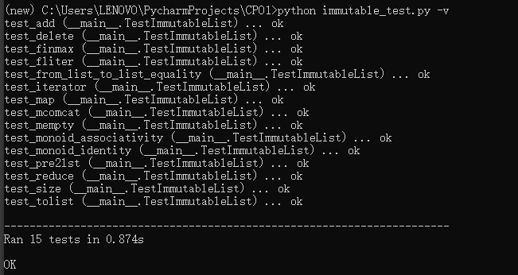

# CPO_lab1

1. Title: Computational Process Organization Lba1
2. List of group members: Chen Sihan 192050195  Yue Xueying 192050217
3. Laboratory work number: 3
4. Variant description: Binary-tree based set
5. Synopsis:
    1. add a new element (lst.add(3), cons(lst, 3), extend(lst, 3));
    2. remove an element (lst.remove(3), remove(lst, 3));
    3. size (lst.size(), size(lst));
    4. conversion from and to python lists (lst.to_list(), lst.from_list([12, 99, 37]), from_list([12, 99, 37]));
    5. find element by specific predicate (lst.find(is_even_), );
    6. filter data structure by specific predicate (lst.filter(is_even));
    7. map structure by specific function (lst.map(increment));
    8. reduce – process structure elements to build a return value by specific functions (lst.reduce(sum));
    9. data structure should be a monoid and implement mempty and mconcat functions or methods;
    10. iterator:
    for the mutable version in Python style [12, Chapter 7. Classes & Iterators];
    for the immutable version by closure [14], see example ahead.
6. Contribution summary for each group member (should be checkable by git log and git blame):
    Chen Sihan: Mutable Part
    Yue Xueying: Immutable Part
7. Explanation of taken design decisions and analysis:
    In 
    immutable, it define the node class, and  all  operations on it are written outside class. 
	For mutable, we define node structure and tree structure, functions are all in tree class
    Immutable objects which state cannot be changed once they are created. Every time they are changed, 
	new objects are generated. Mutable objects whose state can still be changed after creation

8. Work demonstration (how to use developed software, how to test it), should be repeatable by an instructor by given command-line examples;
    1. We write binary tree file and test file on Pycharm.
    2. Use terminal to test the code. 'python3 mutable_test.py -v'
    3. Upload the .py files and result of our programs to github.

9. Conclusion:
    design binary trees in mutable and immutable ways, we realize the function of add new element,remove element,size of the tree
    ,list and tree transform,filter,reduce and so on. we get the difference of mutable and immutable.

